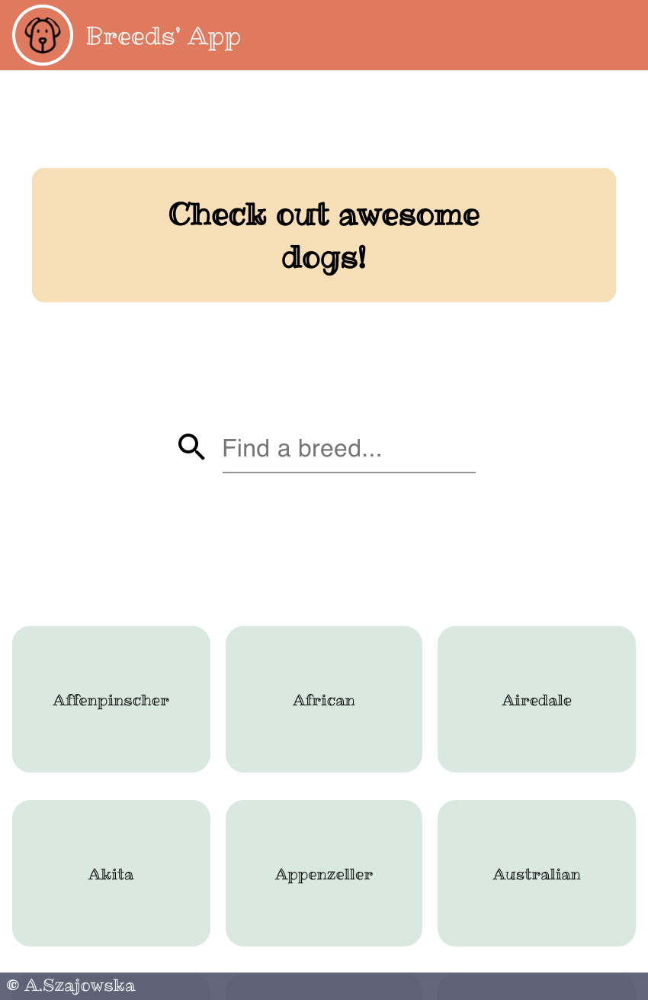
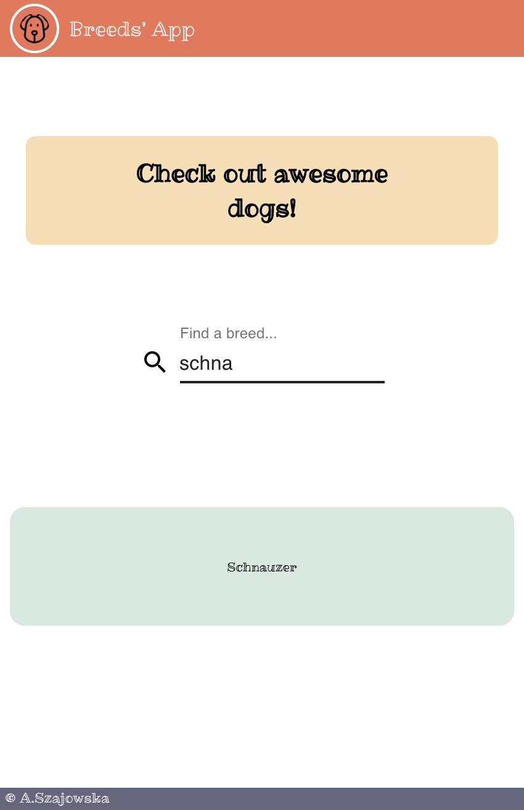
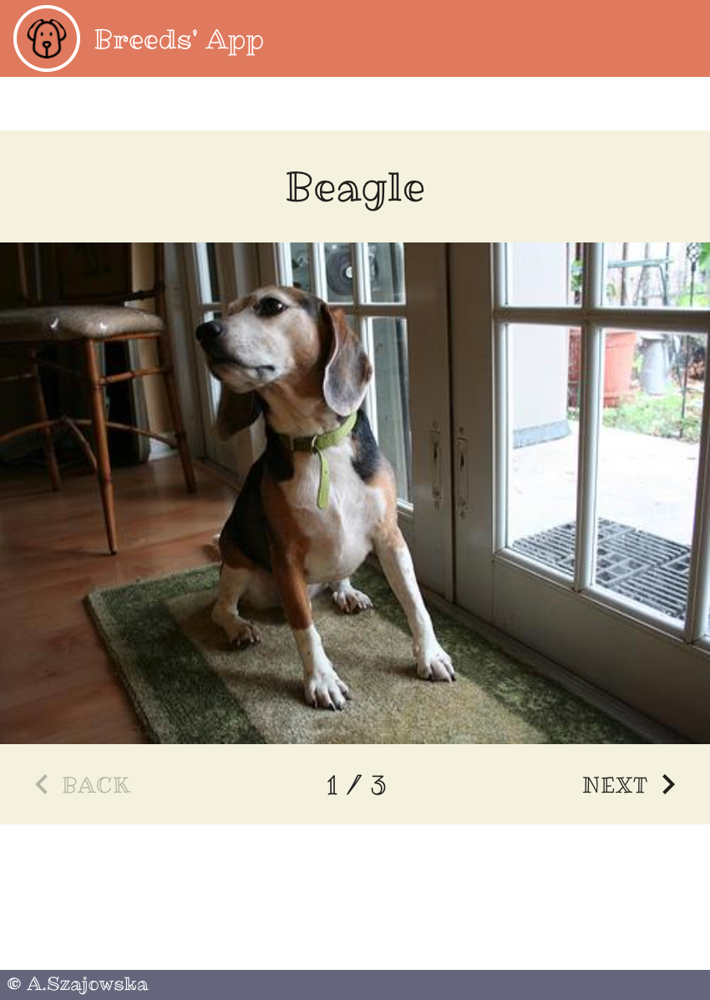
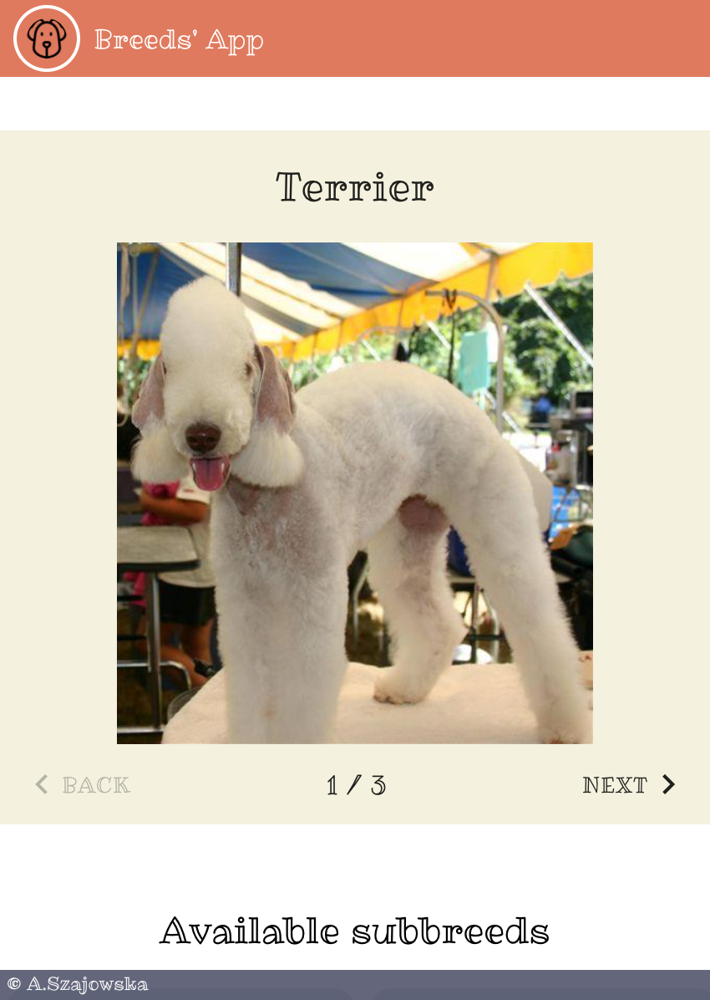
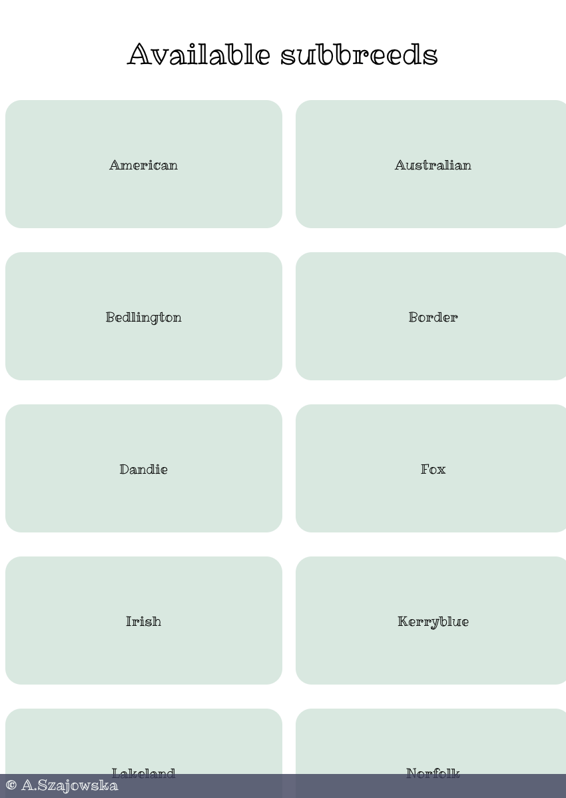

# Dog App

## Table of contents
* [General info](#general-info)
* [Technologies](#technologies)
* [Demo](#demo)
* [Features](#features)
* [Screenshots](#screenshots)

## General info
Wants to buy a dog but have not decided what breed? Take a second and use Dog App to find all dog breeds and their subbreeds. Search if you know the breed name. Choose a breed to view some random photos. Check available subreeds and their photos.

## Technologies
**Frontend:** React, JavaScript, TypeScript, SCSS\
**Backend:** Dog API (https://dog.ceo/dog-api/)

## Demo
https://dogapp.aneta.szajowska.net/

## Features
* Browse dog breeds
* Browse breed subbreeds
* Search by breed
* Check breed photos
* Check subbreed photos

## Screenshots

